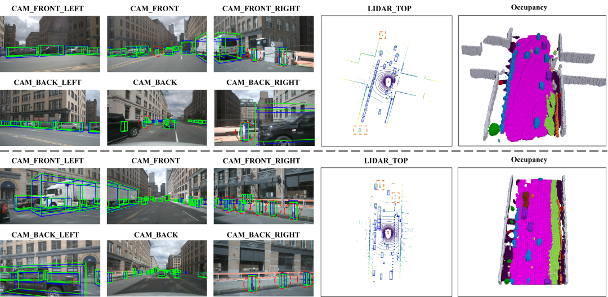

# PolarBEVDet: Exploring Polar Representation for Multi-View 3D Object Detection in Bird's-Eye-View

## News
- **[2025/06/23]** We add support for the occupancy prediction task
- **[2025/06/23]** We add support for Waymo dataset
- **[2025/01/23]** We release the code and pretrained weights for NuScenes dataset
- **[2024/12/04]** PolarBEVDet is on [Arxiv](https://arxiv.org/abs/2408.16200).

## Getting Started
- [Installation](docs/install.md)
- [Data Preparation](docs/prepare_dataset.md)
- [Train and Eval](docs/train_and_eval.md)

## Abstract
Multi-view 3D object detection built upon the Lift-Splat-Shoot (LSS) mechanism provides an economical and
deployment-friendly solution for autonomous driving. However, all existing LSS-based methods transform multi-view image
features into a Cartesian Bird’s-Eye-View (BEV) representation without considering the non-uniform distribution of image infor-
mation. Consequently, this leads to information loss in the near and computational redundancy in the far. Furthermore, these
methods struggle to exploit view symmetry, increasing the difficulty of representation learning. In this paper, to fundamentally
remove these limitations, we propose to replace the Cartesian BEV representation with the polar BEV representation, which
naturally adapts to the image information distribution and effortlessly preserves view symmetry by regular convolution. To
achieve this, we elaborately tailor three modules: a polar view transformer to generate the polar BEV representation, a polar
temporal fusion module for fusing historical polar BEV features and a polar detection head to predict the polar-parameterized
representation of the object. In addition, we design a 2D auxiliary detection head and a spatial attention enhancement module to
improve the quality of feature extraction in perspective view and BEV, respectively. Finally, we integrate the above improvements
into a novel multi-view 3D object detector, PolarBEVDet. Experiments on nuScenes and Waymo show that PolarBEVDet achieves
superior performance, and the polar BEV representation can be seamlessly substituted into different LSS-based detectors with
consistent performance improvement.


## Benchmark Results

### results on nuScenes valid set:
| Setting  | Pretrain | NDS  | MAP  |                                     Weights                                      |
|----------|:--------:|:----:|:----:|:--------------------------------------------------------------------------------:|
| [r50_704x256_24e](projects/configs/polarbevdet/r50_704x256_24e.py) | [ImageNet]([ImageNet](https://download.pytorch.org/models/resnet50-0676ba61.pth))  | 53.0 | 43.2 | [gdrive](https://drive.google.com/file/d/1ft34-pxLpHGo2Aw-jowEtCxyXcqszHNn/view) |
| [r50_704x256_60e](projects/configs/polarbevdet/r50_704x256_60e.py) | [ImageNet]([ImageNet](https://download.pytorch.org/models/resnet50-0676ba61.pth))  | 55.3 | 45.0 | [gdrive](https://drive.google.com/file/d/1L776m7csFlDS2LHxMz-1q2eQTyc1Y_V0/view) |
| [r50_704x256_nuImg_60e](projects/configs/polarbevdet/r50_704x256_nuImg_60e.py) | [nuImg](https://download.openmmlab.com/mmdetection3d/v0.1.0_models/nuimages_semseg/cascade_mask_rcnn_r50_fpn_coco-20e_20e_nuim/cascade_mask_rcnn_r50_fpn_coco-20e_20e_nuim_20201009_124951-40963960.pth)  | 56.7 | 46.9 | [gdrive](https://drive.google.com/file/d/1dKu5cR1fuo-O0ynyBh-RCPtHrgut29mN/view) |

### results on Waymo valid set:
| Setting  | Pretrain | mAPL | mAPH  | mAP  |
|----------|:--------:|:----:|:-----:|:----:|
| [r101_832x1920_24e](projects/configs/polarbevdet_waymo/r101_832x1920_24e.py) | [nuImg](https://download.openmmlab.com/mmdetection3d/v0.1.0_models/nuimages_semseg/cascade_mask_rcnn_r101_fpn_1x_nuim/cascade_mask_rcnn_r101_fpn_1x_nuim_20201024_134804-45215b1e.pth)  | 43.8 | 54.9  | 59.6 |

Regrettably, we are unable to provide the model weights due to [Waymo Dataset License Agreement](https://waymo.com/open/terms/)

### results on Occ3D-nuScenes valid set:
| Setting  | mIoU | RayIoU |                                     Weights                                      |
|----------|:----:|:------:|:--------------------------------------------------------------------------------:|
| [r50_704x256_24e](projects/configs/polarbevdet_occ/r50_704x256_24e.py) | 33.7 |  39.4  | [gdrive](https://drive.google.com/file/d/1rcTPX5cKFJthOFuZ73WA0OuSc_geMaD7/view) |

## Visualization


## Acknowledgement

Many thanks to these excellent open-source projects:

* 3D Detection:[BEVDet](https://github.com/HuangJunJie2017/BEVDet), [SOLOFusion](https://github.com/Divadi/SOLOFusion), [StreamPETR](https://github.com/exiawsh/StreamPETR)
* Codebase: [MMDetection3D](https://github.com/open-mmlab/mmdetection3d)

## Bibtex
If this work is helpful for your research, please consider citing the following BibTeX entry.
```
@article{yu2024polarbevdet,
  title={PolarBEVDet: Exploring Polar Representation for Multi-View 3D Object Detection in Bird's-Eye-View},
  author={Yu, Zichen and Liu, Quanli and Wang, Wei and Zhang, Liyong and Zhao, Xiaoguang},
  journal={arXiv preprint arXiv:2408.16200},
  year={2024}
}
```