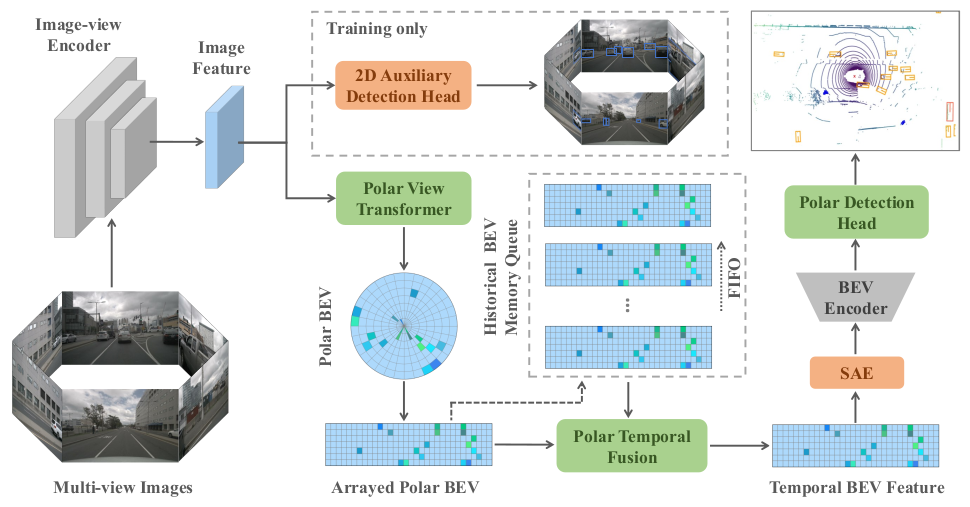

# PolarBEVDet

This is the official PyTorch implementation for our paper:
> [**PolarBEVDet: Exploring Polar Representation for Multi-View 3D Object Detection in Bird's-Eye-View**](https://arxiv.org/abs/2408.16200) 

## Getting Started
Code will be open source soon!